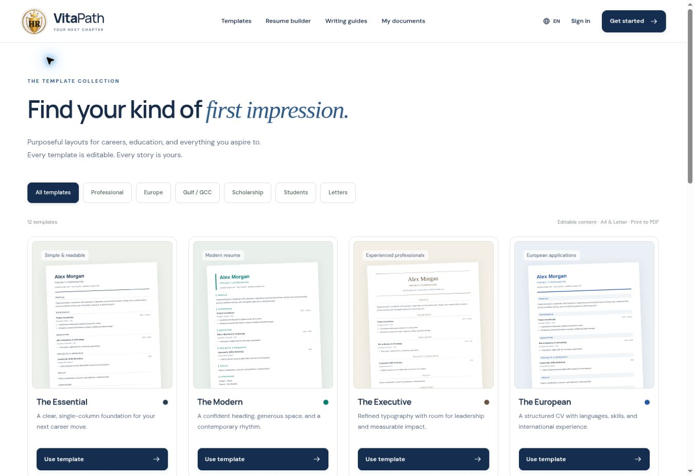

# VitaPath

**Your next chapter starts here.**

[Live website](https://haseebullah-rassoli.github.io/VitaPath/) · [Templates](https://haseebullah-rassoli.github.io/VitaPath/templates/)

VitaPath is a responsive application document workspace built with Next.js static export, React, TypeScript, and Supabase. GitHub Pages publishes `main` through the existing Actions workflow. Fonts are bundled locally.



## Included

- Eight distinct, single-column CV layouts: Essential, Modern, Executive, European, Gulf/GCC, Scholar, Graduate, and Academic.
- Cover letters, motivation letters, recommendation drafts, and personal statements.
- Guided editing with repeatable experience, education, project, and volunteering entries; live previews; accent colours; A4/Letter paper.
- Browser draft saving, legacy draft migration, document duplication and deletion, JSON backup export/import.
- Supabase email/password registration, sign-in, confirmation resend, password recovery, sign-out, profile editing, and private document CRUD.
- Explicit cloud saving with optimistic concurrency protection against overwriting another tab's changes.
- Browser print-to-PDF with selectable text, multi-page flow, and no editor controls in output.
- Writing guides, a practical content checklist (not an ATS score), and an accurate privacy page.

## Develop and verify

Use Node 22 or newer.

```sh
npm ci
npm run dev
npm run build
npm run typecheck
npm start
```

The development server uses `/`; the static preview and GitHub Pages use `/VitaPath/`. `npm start` serves the export at `http://127.0.0.1:4173/VitaPath/`.

```sh
npx playwright install chromium
npm test
```

Build before running tests. Tests run against the static export and cover the public workflows, draft persistence, templates, imports, auth error states, mobile layout, and multi-page PDF output. `CHROMIUM_PATH` can point to an existing Chromium executable. Browser auth error tests use mocked responses; they do not send emails or prove production email delivery.

## Supabase

The connected project is `hudtdmerjzqmyvgwajub`. `.env.example` and `lib/supabase/client.ts` contain only public, browser-safe credentials. No service-role key is used. Policies protect each document by `auth.uid() = user_id`; profiles use `id`, not `user_id`.

`supabase/schema.sql` documents the current schema. The dated migration adds personal statements, validation, an owner/timestamp index, server-managed modification timestamps, and least-privilege grants. Signup trigger functions are in a private schema with direct execution revoked. Do not run the reference snapshot over the existing database.

### Email launch configuration requiring owner verification

The connected Auth settings report that email signup is enabled and confirmation is required. The connector does not expose the project's redirect allowlist or SMTP configuration. Public registration and reset-email delivery have therefore **not been verified end-to-end**.

In the [Auth URL settings](https://supabase.com/dashboard/project/hudtdmerjzqmyvgwajub/auth/url-configuration):

- Site URL: `https://haseebullah-rassoli.github.io/VitaPath/`
- Allowed redirect URL: `https://haseebullah-rassoli.github.io/VitaPath/login/`
- For local development only, allow `http://localhost:3000/login/`.

Configure an SMTP provider for public email delivery. Supabase's default sender is intended for development and restricts recipients to project-team addresses. Keep email confirmation enabled. Then test a new real account, its confirmation link, sign-in, cloud save/reopen, and password recovery. Never commit SMTP credentials. See [Supabase email setup](https://supabase.com/docs/guides/auth/auth-smtp) and [redirect URLs](https://supabase.com/docs/guides/auth/redirect-urls).

## Scope and limitations

- PDF download uses the browser's print dialog. Turn off browser headers and footers; check the output before submitting.
- European CVs are independent layouts, not official Europass exports.
- No paid AI generation, hiring score, subscription system, or third-party OAuth provider is implied.
- Browser drafts are visible to other people using the same browser profile and may be lost when storage is cleared. Cloud documents are not end-to-end encrypted. Account deletion is not self-service in this version.
- Recommendation letters remain clearly marked as drafts for recommender review.
